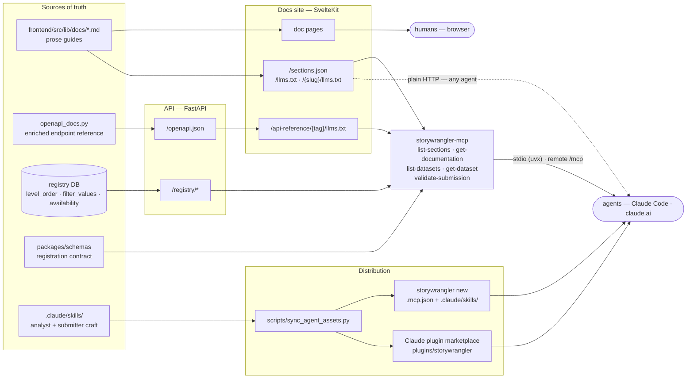

# Storywrangler

A research data registry and query platform for computational social science.
Groups register datasets (parquet on institutional storage), the platform validates
identifiers, tracks lineage, and serves instruments to
[Complex Stories](https://complexstories.uvm.edu).

## Monorepo Structure

```
storywrangler/
  backend/              FastAPI — registry, query layer, routers, /mcp mount
  frontend/             SvelteKit documentation site + llms.txt exports
  packages/
    schemas/            Shared Pydantic schemas + assign_bucket()
    sdk/                Python SDK — CLI, client, entity validation
    mcp-server/         storywrangler-mcp — MCP tools for AI agents
    templates/          Pipeline templates (simple-make)
  plugins/
    storywrangler/      Claude plugin (skills + MCP config), via in-repo marketplace
  scripts/              sync_agent_assets.py — skill sync to SDK + plugin
```

See [`packages/sdk/README.md`](packages/sdk/README.md) for SDK usage.

## Registering a Dataset

```bash
uvx storywrangler new my-dataset --format parquet_hive
cd my-dataset
cp .env.example .env   # DATASET_ID, DOMAIN, DATA_PATH, API_KEY
uv sync
make submit
```

Registration is an upsert — safe to re-run. The server auto-derives `data_schema`,
`level_order`, `manifest.availability`, `filter_values`, and `hash_bucket` config
from the data at registration time.

## Agent & LLM Layer

The platform is agent-friendly by design, following the pattern of
[sveltejs/ai-tools](https://github.com/sveltejs/ai-tools): durable prose lives
as markdown (single source for the website *and* machine exports), the volatile
API reference is rendered live from the OpenAPI spec, and an MCP server fetches
everything at runtime so nothing drifts. Skills carry the workflow craft and are
distributed through project scaffolding and a Claude plugin marketplace.



Reading the diagram:

- **Left column is the only place content is authored.** Guides are markdown in
  the frontend; endpoint docs are `openapi_extra` payloads in the backend;
  dataset metadata is introspected into the registry at registration time;
  skills are edited in `.claude/skills/` only.
- **The docs site serves both audiences from the same markdown** — HTML pages
  for humans, `sections.json` + per-section `llms.txt` for machines. The
  endpoint reference is fetched from the live `openapi.json` on request, so it
  can never go stale.
- **The MCP server holds no content.** It fetches docs from the site and
  metadata from the registry, and runs `validate-submission` locally against
  the real schemas package. Same tools over two transports: `uvx
  storywrangler-mcp` (stdio) or the backend's `/mcp` endpoint (remote).
- **Skills reach users two ways**: scaffolded into new dataset projects by
  `storywrangler new`, or installed via
  `/plugin marketplace add Vermont-Complex-Systems/storywrangler`.

See [`packages/mcp-server/README.md`](packages/mcp-server/README.md) for MCP
configuration and the [Agent/LLM layer notes in `CLAUDE.md`](CLAUDE.md) for
maintenance conventions (where to edit what).

## Standards

Implements [Storywrangler Specification v0.0.3](https://github.com/vermont-complex-systems/Storywrangler-Specification/blob/main/versions/0.0.3.md).

## Development

```bash
uv sync                                        # install dependencies
uv run uvicorn backend.app.main:app --reload   # API server
uv run pytest backend/tests/                   # tests
cd frontend && npm run dev                     # docs site
```
